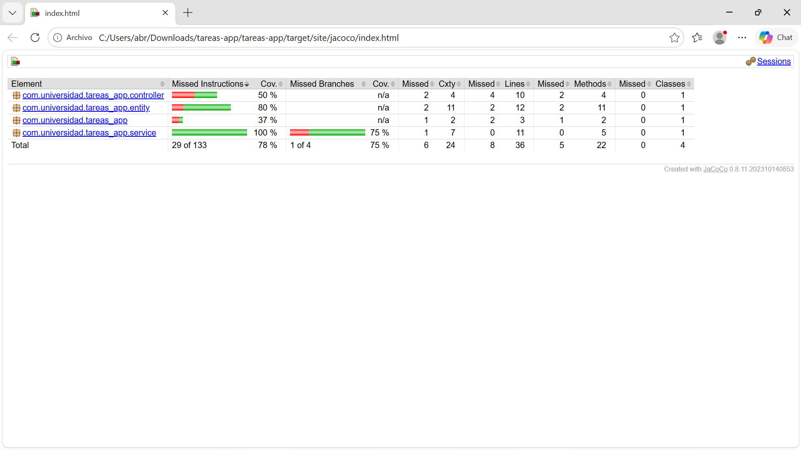

# Suite de Pruebas con JUnit 5, Mockito y JaCoCo

Aplicación Spring Boot de gestión de tareas con suite de pruebas automatizadas implementando JUnit 5, Mockito y JaCoCo.

---

## Prerrequisitos

- Java 17 o superior
- Maven 3.9.x
- IDE con soporte Java (IntelliJ IDEA o VS Code con Extension Pack for Java)

---

## Configuración de base de datos para pruebas

Las pruebas utilizan **H2 en memoria**, lo que significa que no se requiere ninguna base de datos externa instalada. Spring Boot configura H2 automáticamente al detectar la dependencia en el `pom.xml`. Cada prueba que usa `@DataJpaTest` crea su propia base de datos en memoria y revierte los cambios automáticamente al finalizar, garantizando el aislamiento entre tests.

No se necesita modificar ningún archivo de configuración para ejecutar las pruebas.

---

## Cómo ejecutar las pruebas

### Ejecutar todos los tests

```bash
mvn test
```

### Ejecutar solo un test específico

```bash
mvn test -Dtest=TareaServiceTest
```

### Ejecutar tests y verificar cobertura con JaCoCo

```bash
mvn clean verify
```

Este comando ejecuta los 9 tests, genera el reporte de cobertura y verifica que se cumpla el umbral mínimo del 70%.

### Ver el reporte de cobertura en el navegador

```bash
start target/site/jacoco/index.html
```

---

## Estructura del proyecto

```
src/
├── main/java/com/universidad/tareas_app/
│   ├── TareasAppApplication.java
│   ├── entity/
│   │   └── Tarea.java
│   ├── repository/
│   │   └── TareaRepository.java
│   ├── service/
│   │   └── TareaService.java
│   └── controller/
│       └── TareaController.java
└── test/java/com/universidad/tareas_app/
    ├── service/
    │   └── TareaServiceTest.java
    ├── controller/
    │   └── TareaControllerTest.java
    └── repository/
        └── TareaRepositoryTest.java
```

---

## Descripción de las clases de prueba

### TareaServiceTest

Ubicación: `src/test/java/com/universidad/tareas_app/service/TareaServiceTest.java`

Prueba la lógica de negocio de `TareaService` en aislamiento usando `@ExtendWith(MockitoExtension.class)`. El repositorio se simula con `@Mock` y el servicio se inyecta con `@InjectMocks`, evitando cualquier conexión real a base de datos.

| Test | Descripción |
|------|-------------|
| `crear_conTituloValido_guardaYRetorna` | Verifica que al crear una tarea con título válido, el repositorio es invocado con `save()` y retorna la tarea correctamente |
| `crear_conTituloVacio_lanzaIllegalArgumentException` | Verifica que un título en blanco lanza `IllegalArgumentException` y que `save()` nunca es invocado |
| `buscarPorId_noExiste_lanzaEntityNotFoundException` | Verifica que buscar un id inexistente lanza `EntityNotFoundException` |
| `completar_tareaExiste_marcaComoCompletada` | Verifica que al completar una tarea existente, se marca como completada y se persiste |
| `completar_tareaNoExiste_lanzaEntityNotFoundException` | Verifica que completar un id inexistente lanza `EntityNotFoundException` y que `save()` nunca es invocado |

---

### TareaControllerTest

Ubicación: `src/test/java/com/universidad/tareas_app/controller/TareaControllerTest.java`

Prueba la capa web en aislamiento usando `@WebMvcTest(TareaController.class)`. Levanta únicamente el contexto web sin base de datos. El servicio se simula con `@MockBean` y las peticiones HTTP se simulan con `MockMvc`.

| Test | Descripción |
|------|-------------|
| `get_tareaExiste_retorna200` | Verifica que `GET /api/tareas/1` retorna status 200 y el JSON con el título correcto |
| `get_noExiste_retorna404` | Verifica que `GET /api/tareas/99` retorna status 404 cuando el servicio lanza `EntityNotFoundException` |

---

### TareaRepositoryTest

Ubicación: `src/test/java/com/universidad/tareas_app/repository/TareaRepositoryTest.java`

Prueba la capa de persistencia usando `@DataJpaTest`. Levanta únicamente el contexto JPA con H2 en memoria. Se usa `TestEntityManager` en `@BeforeEach` para insertar datos de prueba, y los cambios se revierten automáticamente entre tests.

| Test | Descripción |
|------|-------------|
| `findByCompletada_false_retornaUnaTarea` | Verifica que el método `findByCompletada(false)` retorna exactamente una tarea con el título correcto |

---

## Configuración de JaCoCo

El plugin `jacoco-maven-plugin 0.8.11` está configurado en el `pom.xml` con tres goals:

- **prepare-agent**: instrumenta el bytecode para medir cobertura durante los tests
- **report**: genera el reporte HTML en `target/site/jacoco/index.html`
- **check**: verifica que la cobertura de líneas sea mayor o igual al 70%, excluyendo la clase principal y las entidades

Si la cobertura no alcanza el 70%, el build falla con `BUILD FAILURE`.

---

## Evidencia de cobertura JaCoCo

El reporte generado en `target/site/jacoco/index.html` muestra una cobertura superior al 70% en el paquete `service`.



---

## Resultados de los tests

```
Tests run: 9, Failures: 0, Errors: 0, Skipped: 0
All coverage checks have been met.
BUILD SUCCESS
```
